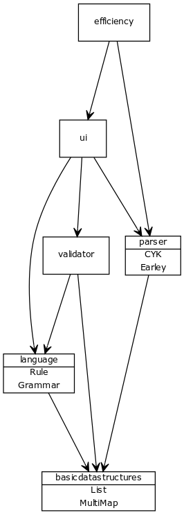

## Implementation

### Project structure

- The project has now 5 packages
    - `basicdatastructures`
        - List and MultiMap
    - `language`
        - Represents the rules and the grammar, uses the basic data structures
    - `parser`
        - The two parser algorithms, use the elements from the packages language
    - `ui`
        - Receives the inputs, calls validator and parsers
    - `validator`   
        - Validates the inputs, prepares the data structures for ui
    
### Time and space complexities, comparison

### Possible flaws and improvements
- The program could be extended to also produce the parse trees for the phrase. There could be many of them, and at least the CYK can be modified easily to produce multiple parse trees.

### Sources
- https://materiaalit.github.io/intro-to-ai/part5/, part 2.3.
- https://en.wikipedia.org/wiki/CYK_algorithm
- https://en.wikipedia.org/wiki/Earley_parser

