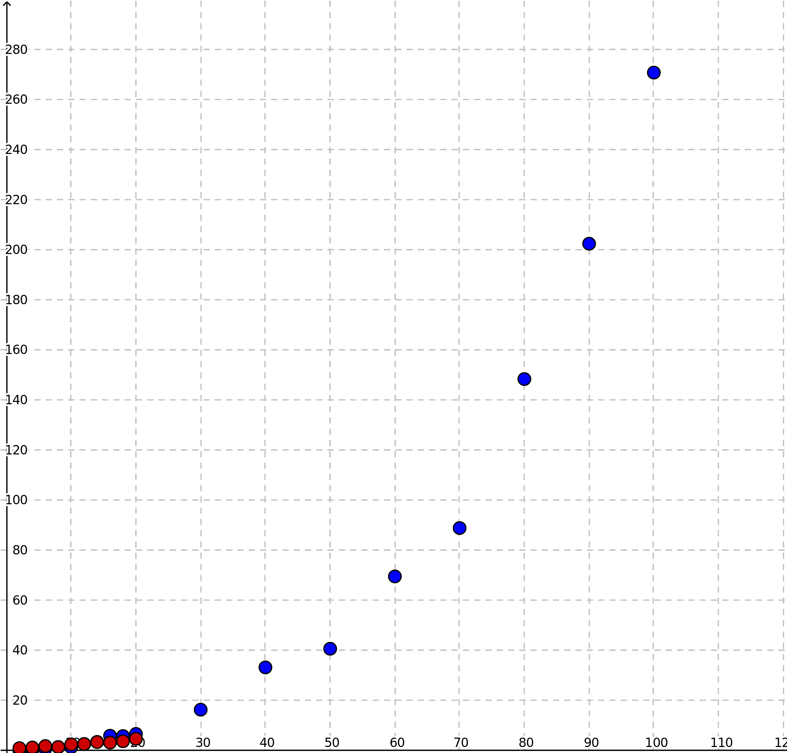
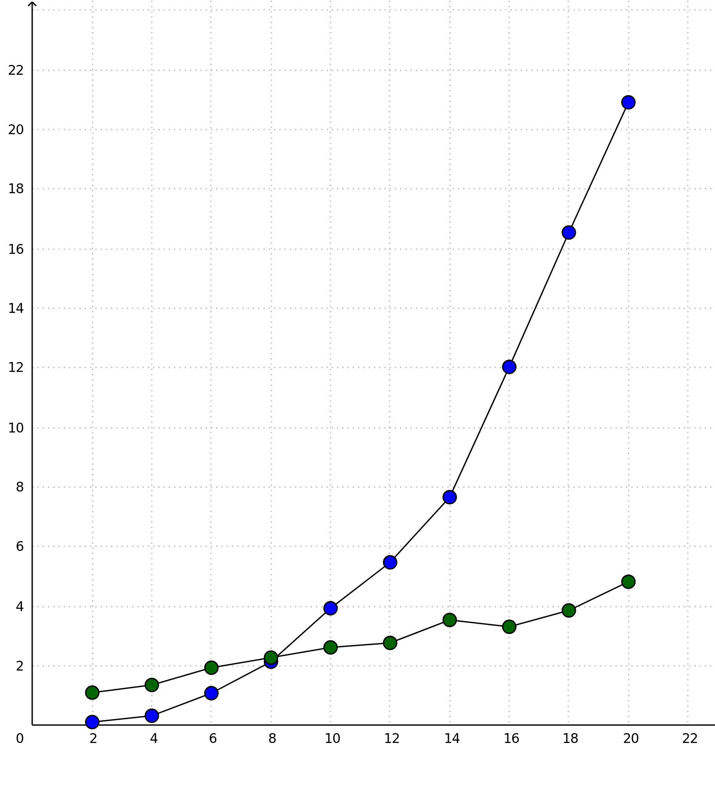
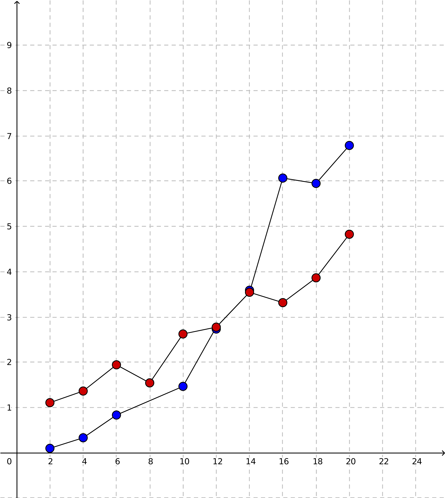

## About testing and performance

### Week 5

#### Testing in general

Most classes have been tested with JUnit as soon as possible after the first implementation. I would have liked to actually try the test driven development way of writing tests before implementation, but I still found it useful to first figure out a basic draft of a class.

I'm aiming for writing tests for any methods doing something more complicated than merely returning or setting values. So far I haven't tested the ui-package, nor the main.

#### Performance testing

This is the first week of performance testing. I tested both algorithms with a fairly small input, but the Earley parser is already somewhat faster than CYK.

I tested the algorithms in separate classes (both in package `efficiencytesting`), since i read that the state of the processor or the JVM could have an effect on performance if the tests would be done during the same run.

I measured the time with `System.nanoTime()` right before and after the execution of each algorithm, and substracted the time before from the time after.

The CYK-algorithm manages to parse the given sentence in the range of 0.002-0.004 seconds, whereas the Earley parser takes 0.0015-0.0025 seconds.

---
More on performance:

##### Comparing the time complexities empirically

CYK is supposed to be time complexity O(mn3), whereas Earley is supposed to be O(m2n3).
Here I tested performance on the length of the phrase (n), because it should have the largest impact on the perormance, and also because it was easier to generate multiple phrases than multiple grammars of a range of lengths.

I tested both parsers with the same grammar and same inputs, and noted the time they took in milliseconds. I tested them a couple of times each in order to get some kind of an average. I measured the time separately with the classes `CykEfficiency` and `EarleyEfficiency`.
The test grammar was the one checking correctly placed [parentheses](../src/resources/parentheses/grammar.txt).

My version of CYK is probably still quite suboptimal. With a couple of small improvements on an implementation level, I easily almost halved the time it took. 
Personally, this mainly raises more concerns about how much could still be optimised. This is also why i suspect, my version of CYK doesn't seem to be that much more efficient than Earley,
and even quickly looks less efficient.

However, the Earley parser still seems to work only partially. In the case of this example grammar, it only accepts inputs up to about 20 characters.
After that, it doesn't accept them anymore, and the time it takes stays in the same range. This is why i didn't include the Earley's results after the length of 20.

tl;dr: these results represent the current state of the program, and quite probably imply a need for optimization (and fixing, in the case of Earley). 

length of phrase (chars) | CYK (ms) | Earley (ms)
-------|-------------|----------------
2   | 0.12      | 1.108     
4   | 0.333     | 1.365     
6   | 0.835     | 1.944    
8   | 1.545     | 2.283     
10  | 1.468     | 2.625     
12  | 2.734     | 2.776     
14  | 3.591     | 3.546     
16  | 6.068     | 3.317     
18  | 5.95      | 3.865   
20  | 6.788     | 4.827  
30  | 16.473    | 
40  | 33.359
50  | 40.822
60  | 69.706
70  | 89.042
80  | 148.565
90  | 202.640
100 | 271

This picture represents the sheet above. The blue dots are results from CYK, the green and red ones are from Earley.

Because I still wanted to compare the two parsers, here is are a couple of charts of the two:
- before optimising CYK:

- after

